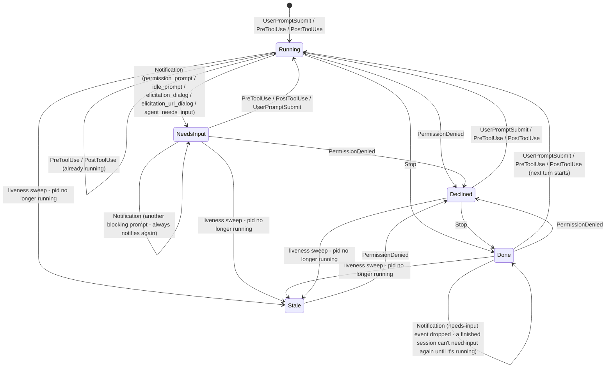
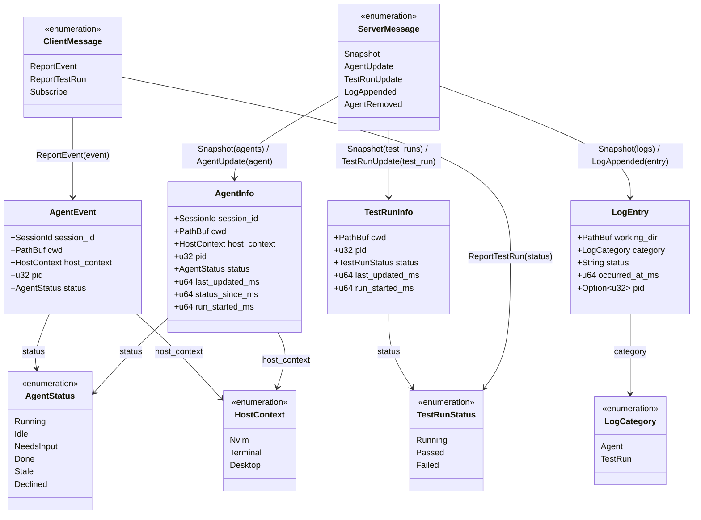

# agent-monitor

A TUI + background daemon for monitoring Claude Code agent sessions on your machine — see what's running, idle, waiting on input, or done, with a macOS notification when a session finishes.

Three binaries:

- **`agentd`** — background daemon, tracks agent status via Claude Code hooks, sends notifications
- **`agentmon`** — the TUI that shows the live list
- **`agentmon-report`** — the hook command that reports status to the daemon

## Install

```
brew tap beet/agent-monitor
brew install agent-monitor
```

If Homebrew refuses the tap as untrusted, run `brew trust beet/agent-monitor` first.

## Setup

```
agentmon-report install-hooks        # registers hooks in ~/.claude/settings.json
brew services start agent-monitor    # installs and starts the daemon as a launchd service
```

Then run `agentmon` in a terminal to see tracked sessions.

### RSpec test-run notifications (optional)

Run `agentmon init-rspec` in a Ruby project. It writes a `.rspec-local` file (untracked, leaves `.rspec` alone) that reports each `bundle exec rspec` run's start/pass/fail to `agentd`, matched to whatever agent(s) are tracked in that directory - whether the run came from an agent, nvim, or a plain terminal. A failing run with no tracked agent still triggers a plain macOS notification.

#### Editor test runners (e.g. neotest-rspec)

Test runners that pass their own `-f`/`--format` flag (most editor integrations do) override `.rspec-local`'s formatter instead of combining with it, so it won't load by default. Point the runner's own command-building option at it instead. For [neotest-rspec](https://github.com/olimorris/neotest-rspec):

```lua
require("neotest-rspec")({
  rspec_cmd = function()
    local cmd = { "bundle", "exec", "rspec" }
    -- brew --prefix, not a hardcoded path, so this works across machines/Homebrew prefixes
    if vim.fn.executable("brew") == 1 then
      local prefix = vim.fn.system("brew --prefix agent-monitor"):gsub("%s+$", "")
      if vim.v.shell_error == 0 then
        local formatter_path = prefix .. "/share/agent-monitor/rspec_formatter.rb"
        if vim.fn.filereadable(formatter_path) == 1 then
          vim.list_extend(cmd, { "--require", formatter_path, "--format", "AgentMonitorRspecFormatter" })
        end
      end
    end
    return cmd
  end,
})
```

Other tools that pass their own `--format` need the same treatment: whatever option they expose for customizing the base command.

## Upgrade

```
brew upgrade agent-monitor
brew services restart agent-monitor
```

## How it works

`agentmon-report` runs as a Claude Code hook and reports each hook event to `agentd`, which maps it onto a status for the session. `agentd`'s own liveness sweep (not a hook) detects when a tracked process has exited and marks it stale. (A fifth status, `idle`, is defined in the protocol but not currently produced by any hook, so it doesn't appear below.)



Tracked agents and test runs are grouped by exact working directory. A test run has no session id of its own - it can't, since Claude Code never propagates one into a Bash tool's subprocess tree, and a run may not even be agent-initiated - so `agentd` correlates it purely by directory instead. `agentmon`'s TUI shows each directory's tracked agent(s) together with any test run(s) there, rather than as unrelated rows.

## Data model

`agentmon-proto` defines the wire types shared by `agentd` and its clients (`agentmon`, `agentmon-report`). `AgentEvent` is what a hook reports in; `AgentInfo` and `TestRunInfo` are what the daemon tracks and sends back out; `LogEntry` is what lands in the [activity log](#activity-log). `ClientMessage` and `ServerMessage` are the envelopes each side actually sends over the socket.



## Activity log

`agentd` keeps a bounded, global history of the last 500 notification-worthy events - an agent going "done" or "needs input", and a test run starting, passing, or failing - so you can see what happened while you weren't watching, not just live state. The TUI's **Logs** tab (`Tab` or `L` to switch) lists that history across every project, most recent first, sortable and filterable by project or status. Pressing `Enter` on a project row (in either tab) opens a details modal with that project's tracked agents, its last test run, and its own activity log.

## Supported hosts

Works for Claude Code sessions in a terminal or nvim's embedded terminal. The desktop app isn't supported — it runs sessions in a sandboxed environment that can't execute local hooks (it has its own built-in notifications instead).

## Uninstall

```
agentd uninstall
brew uninstall agent-monitor
```

Then remove the `agentmon-report` entries from `~/.claude/settings.json`'s `hooks` section.
