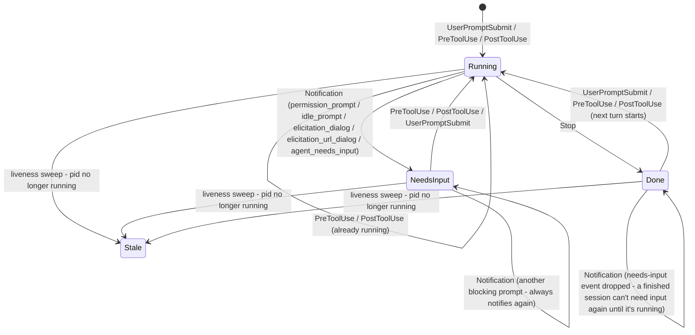

# agent-monitor

A TUI + background daemon for monitoring Claude Code agent sessions on your machine — see what's running, idle, waiting on input, or done, with a macOS notification when a session finishes.

Three binaries:

- **`agentd`** — background daemon, tracks agent status via Claude Code hooks, sends notifications
- **`agentmon`** — the TUI that shows the live list
- **`agentmon-report`** — the hook command that reports status to the daemon

## Install

```
brew tap beet/agent-monitor
brew install agent-monitor
```

If Homebrew refuses the tap as untrusted, run `brew trust beet/agent-monitor` first.

## Setup

```
agentmon-report install-hooks        # registers hooks in ~/.claude/settings.json
brew services start agent-monitor    # installs and starts the daemon as a launchd service
```

Then run `agentmon` in a terminal to see tracked sessions.

### RSpec test-run notifications (optional)

In a Ruby project, run:

```
agentmon init-rspec
```

This writes a `.rspec-local` file (RSpec's own mechanism for personal, untracked local options) pointing at the bundled formatter, without touching the project's tracked `.rspec`. Once in place, `bundle exec rspec` reports each run's start/pass/fail to `agentd`, correlated by working directory to whatever agent(s) are tracked there - regardless of whether the run was started by an agent's own tool call, from nvim, or from another terminal. A failing run in a directory with no tracked agent still gets a plain macOS notification so results are never silently dropped.

#### Editor test runners (e.g. neotest-rspec)

`.rspec-local` alone isn't enough for editor/test-runner integrations that invoke `rspec` with their own explicit `-f`/`--format` flags - which is most of them, since they need their own formatter to parse results back into the editor. RSpec merges CLI, file (`.rspec`/`.rspec-local`), and `SPEC_OPTS` options from separate sources, but for the formatter list specifically, whichever source runs *last* completely replaces the others rather than combining with them - it does not append. Since these tools pass `-f`/`--format` directly on the command line, that always wins over `.rspec-local`'s `--format` entry, silently dropping this formatter even though it's still `--require`d (only `:libs`/`:requires` are merged additively across sources; `:formatters` is not).

The fix is to get this formatter's `--require`/`--format` onto the *same* command line the tool builds, rather than a separate file - multiple `-f` flags within one source do coexist normally. For [neotest-rspec](https://github.com/olimorris/neotest-rspec), whose adapter builds its command by flattening its own `-f`/`-o` flags onto whatever `rspec_cmd` returns, that means overriding `rspec_cmd` in its setup:

```lua
require("neotest-rspec")({
  rspec_cmd = function()
    local cmd = { "bundle", "exec", "rspec" }
    -- Resolve via `brew --prefix`, not a hardcoded path, so this survives
    -- being shared across machines with different Homebrew prefixes
    -- (Apple Silicon vs Intel) and across `brew upgrade`.
    if vim.fn.executable("brew") == 1 then
      local prefix = vim.fn.system("brew --prefix agent-monitor"):gsub("%s+$", "")
      if vim.v.shell_error == 0 then
        local formatter_path = prefix .. "/share/agent-monitor/rspec_formatter.rb"
        if vim.fn.filereadable(formatter_path) == 1 then
          vim.list_extend(cmd, { "--require", formatter_path, "--format", "AgentMonitorRspecFormatter" })
        end
      end
    end
    return cmd
  end,
})
```

Other editor/CI integrations that pass their own `--format` will need the equivalent: whatever mechanism they expose for customizing their base command, rather than relying on `.rspec-local`.

## Upgrade

```
brew upgrade agent-monitor
brew services restart agent-monitor
```

## How it works

`agentmon-report` runs as a Claude Code hook and reports each hook event to `agentd`, which maps it onto a status for the session. `agentd`'s own liveness sweep (not a hook) detects when a tracked process has exited and marks it stale. (A fifth status, `idle`, is defined in the protocol but not currently produced by any hook, so it doesn't appear below.)



Tracked agents and test runs are grouped by exact working directory. A test run has no session id of its own - it can't, since Claude Code never propagates one into a Bash tool's subprocess tree, and a run may not even be agent-initiated - so `agentd` correlates it purely by directory instead. `agentmon`'s TUI shows each directory's tracked agent(s) together with any test run(s) there, rather than as unrelated rows.

## Supported hosts

Works for Claude Code sessions in a terminal or nvim's embedded terminal. The desktop app isn't supported — it runs sessions in a sandboxed environment that can't execute local hooks (it has its own built-in notifications instead).

## Uninstall

```
agentd uninstall
brew uninstall agent-monitor
```

Then remove the `agentmon-report` entries from `~/.claude/settings.json`'s `hooks` section.
